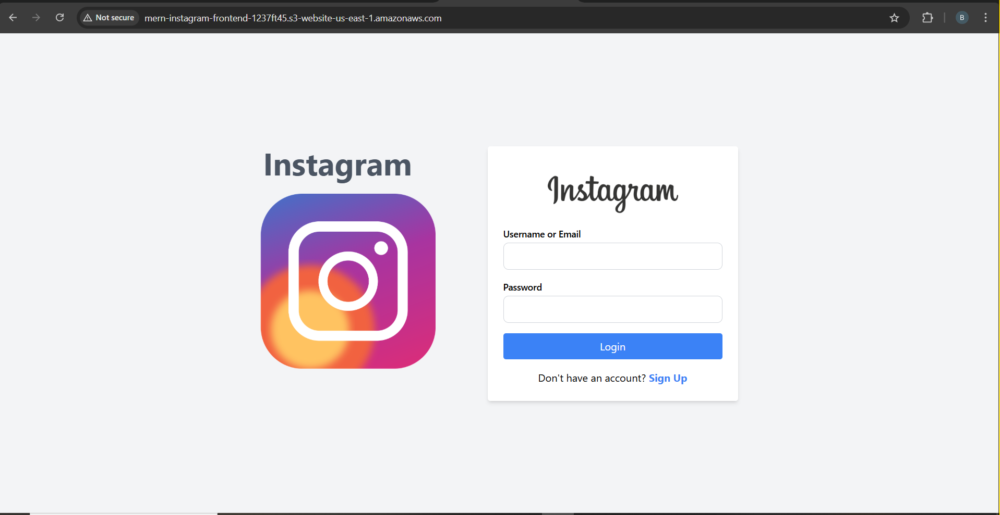
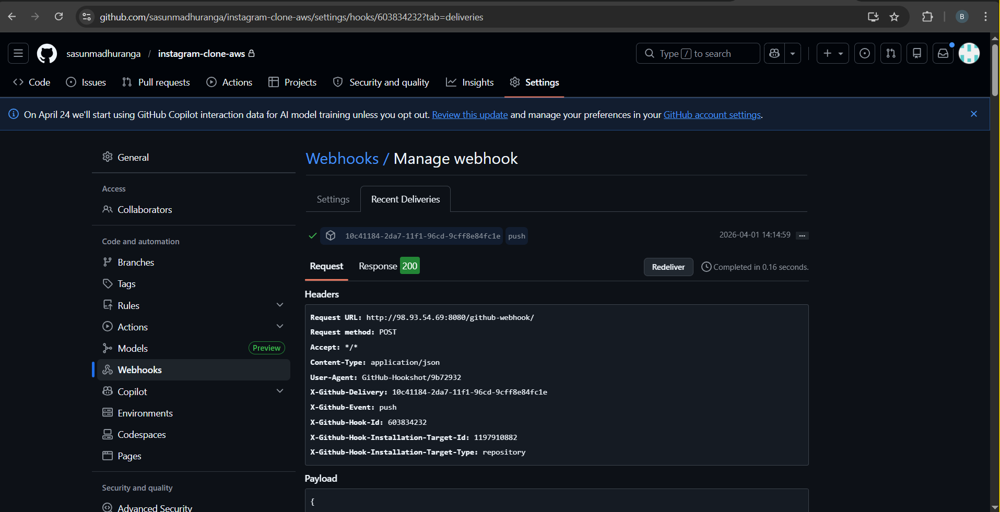
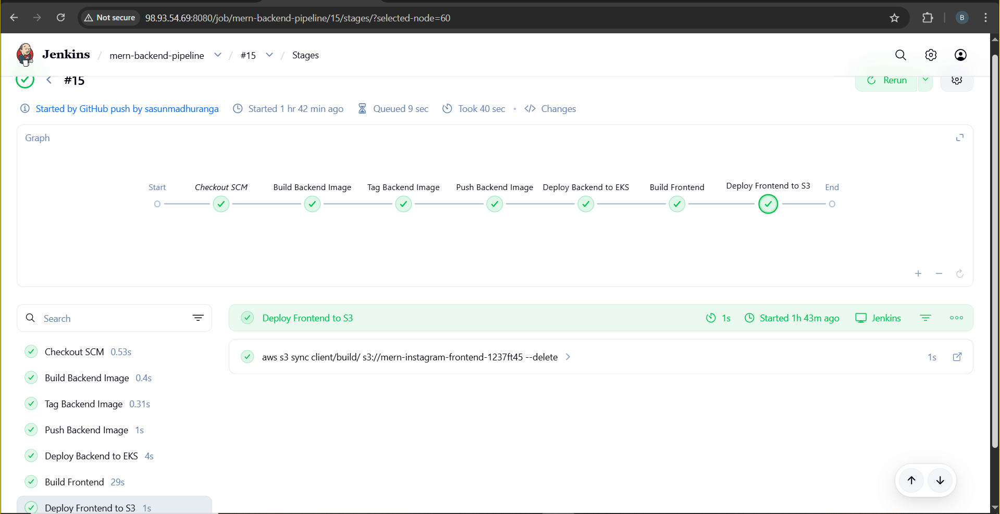
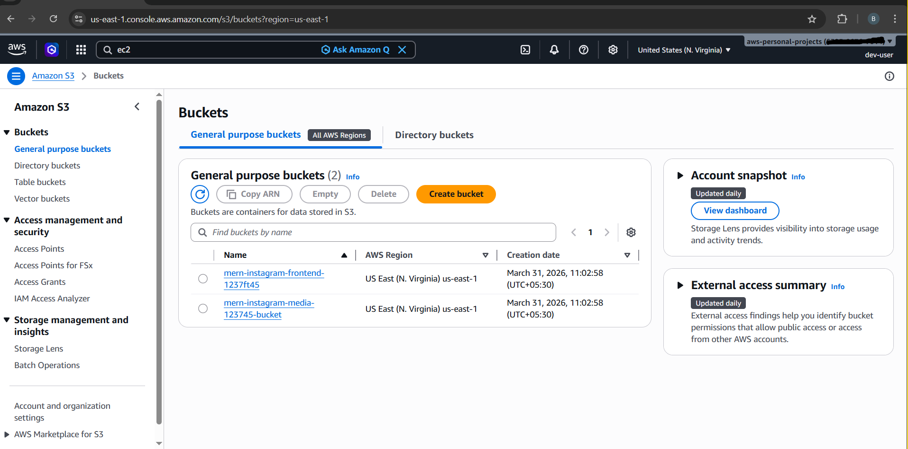
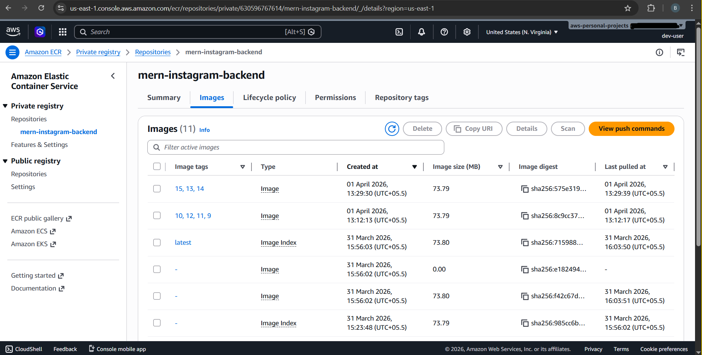
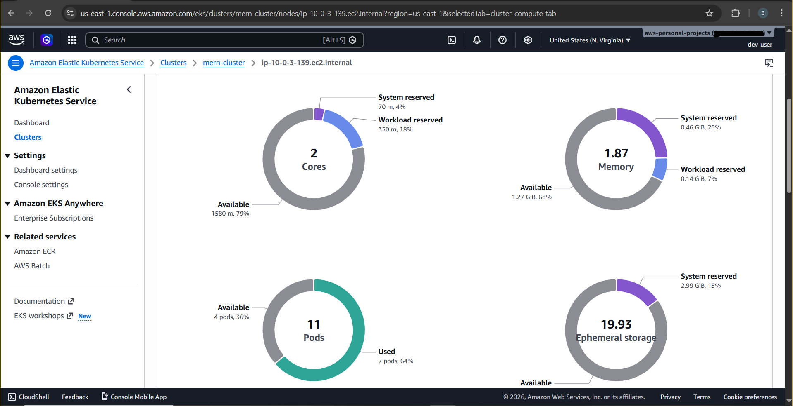

Instagram Clone – Cloud-Native Deployment on AWS

This project is a full-stack Instagram clone built using the MERN stack and deployed using a cloud-native architecture on AWS. It demonstrates real-world DevOps practices, including containerization, Kubernetes orchestration, CI/CD automation, and infrastructure as code.

✔ Tech Stack

Frontend

•	React.js 
•	Tailwind CSS 

Backend

•	Node.js 
•	Express.js 

Database

•	MongoDB Atlas 

Cloud & DevOps

•	AWS EKS (Kubernetes) 
•	AWS ECR 
•	AWS S3 (Frontend + Media) 
•	AWS ALB (Ingress) 
•	AWS VPC (Networking) 
•	Terraform (Infrastructure as Code) 
•	Jenkins (CI/CD) 
•	Docker 

✔ Features

•	🔐 JWT Authentication (Login/Register) 
•	📝 Create, like, comment, and save posts 
•	👥 Follow/Unfollow users 
•	🔍 User search & discovery 
•	🖼 Media upload to AWS S3 
•	📄 Profile management 
•	💾 Saved posts functionality 

✔ Kubernetes Setup

•	Deployment (Backend API) 
•	ClusterIP Service (Internal communication) 
•	Ingress (ALB via AWS Load Balancer Controller) 

✔ CI/CD Pipeline

Automated using Jenkins:
1.	Triggered via GitHub Webhook 
2.	Build Docker image 
3.	Push image to AWS ECR 
4.	Deploy to EKS using rolling updates 
5.	Build frontend 
6.	Deploy frontend to S3 

✔ Infrastructure (Terraform)

Provisioned resources:
•	VPC with public & private subnets 
•	EKS Cluster (managed node group) 
•	S3 buckets (frontend + media) 
•	ECR repository 
•	IAM roles (IRSA enabled) 
•	NAT Gateway + Internet Gateway 
•	AWS Load Balancer Controller 

✔ Networking
•	Backend runs in private subnets 
•	NAT Gateway enables outbound internet access 
•	ALB (Ingress) exposes backend to users 
•	Frontend served via public S3 endpoint 

✔ Challenges & Solutions
🔴 Jenkins couldn’t run Docker
•	Fixed by mounting Docker socket

🔴 Disk space issues on EC2
•	Expanded EBS volume and resized partition 

🔴 Webhook not triggering
•	Fixed Jenkins URL and webhook configuration 

🔴 Kubernetes upgrade issues
•	Upgraded cluster one minor version at a time 

🔴 Backend not accessible
•	Configured Ingress with AWS ALB Controller 

📸 Screenshots

  
  
  
  
  
  

Author

Sasun Madhuranga

GitHub: https://github.com/sasunmadhuranga
